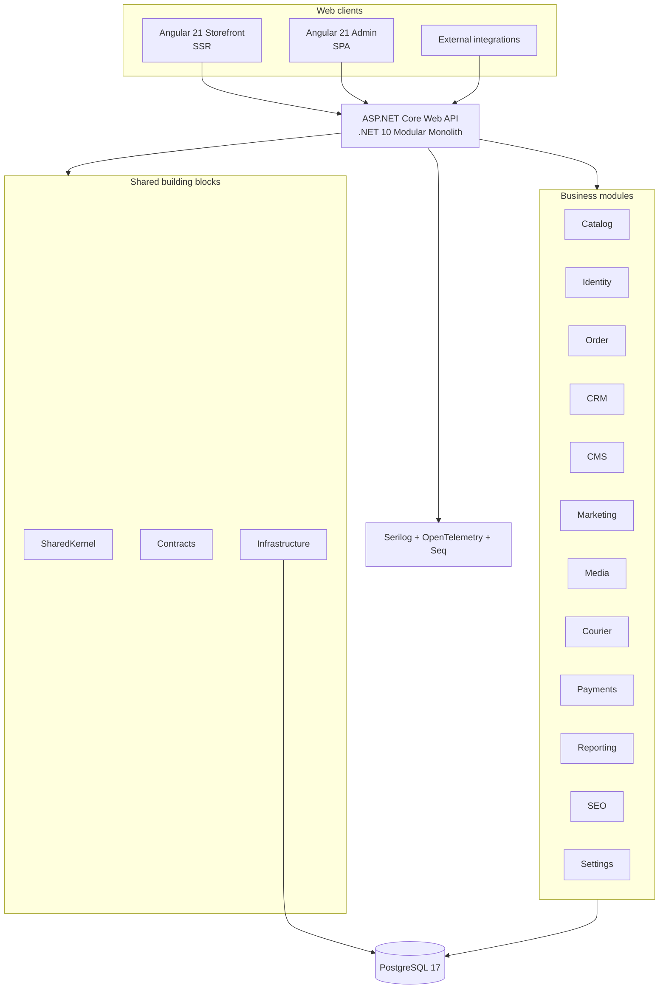

# SaaSCommerce — System Architecture

```mermaid
flowchart TB
  subgraph Web[Web clients]
    Storefront[Angular 21 Storefront\nSSR]
    Admin[Angular 21 Admin\nSPA]
    Integrations[External integrations]
  end
  Host[ASP.NET Core Web API\n.NET 10 Modular Monolith]
  subgraph Business[Business modules]
    Catalog[Catalog]
    Identity[Identity]
    Orders[Order]
    CRM[CRM]
    CMS[CMS]
    Marketing[Marketing]
    Media[Media]
    Courier[Courier]
    Payments[Payments]
    Reporting[Reporting]
    SEO[SEO]
    Settings[Settings]
  end
  subgraph Foundation[Shared building blocks]
    Kernel[SharedKernel]
    Contracts[Contracts]
    Infrastructure[Infrastructure]
  end
  Database[(PostgreSQL 17)]
  Observability[Serilog + OpenTelemetry + Seq]
  Storefront --> Host
  Admin --> Host
  Integrations --> Host
  Host --> Business
  Host --> Foundation
  Business --> Database
  Infrastructure --> Database
  Host --> Observability
```

The diagram is a high-level logical view, not a deployment topology. It intentionally omits private infrastructure details.
